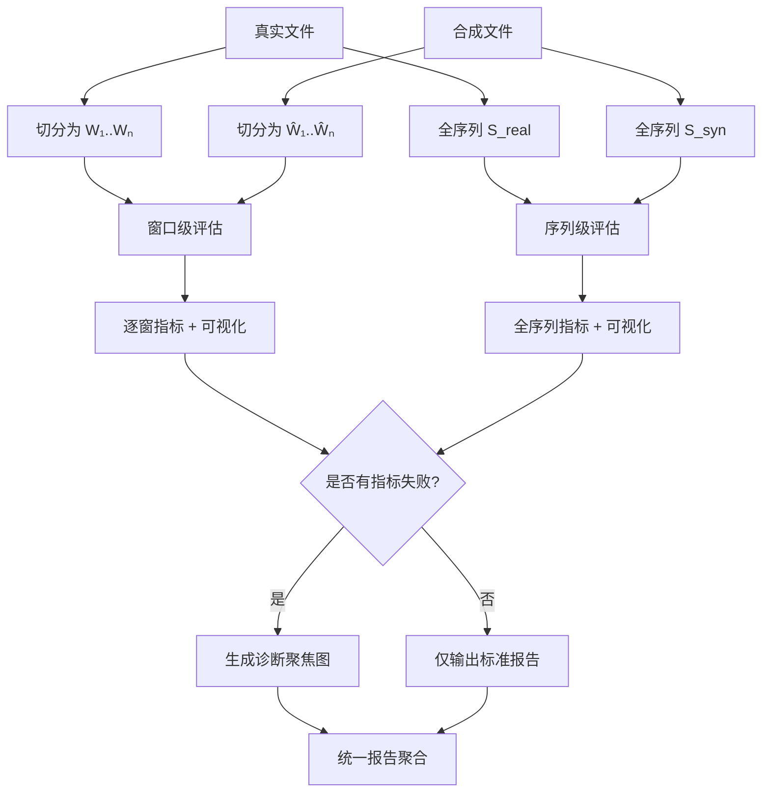

# 🧪 NetFaker 合成数据评估模块设计方案  
**版本：2.0（窗口 + 序列双粒度 · 三层可视化 · 生产就绪）**

---

## 一、设计目标

> **在 NetFaker “窗口拼接”生成范式下，构建一套覆盖局部保真性与全局合理性的双粒度评估体系，并通过三层可视化实现“指标 → 图 → 根因”的快速诊断闭环。**

### 核心诉求
- ✅ **双粒度评估**：
  - **窗口级**：验证每个 10 秒片段是否像真实
  - **序列级**：验证整条流是否具有真实网络的动态特性
- ✅ **状态感知**：结合 `state_id` 支持状态转移合理性分析
- ✅ **自动化门禁**：输出通过率，支持 CI/CD 质量卡点
- ✅ **三层可视化**：从全局到局部再到根因，层层深入
- ✅ **轻量可插拔**：不侵入生成逻辑，复用现有 IO 模块

---

## 二、输入规范

| 项目 | 要求 |
|------|------|
| **文件格式** | 标准 HoloWAN `.txt`（由 `holowan_saver.py` 生成） |
| **通道** | 默认评估 **上行延迟（ms） + 上行丢包率（%）**（可配置） |
| **对齐方式** | - 窗口级：按窗口一一对应- 序列级：等长全序列（无需绝对时间对齐） |
| **长度** | - 必须为 100 的整数倍（N × 10 秒）- **序列级建议 ≥ 3000 点（5 分钟+）** |
| **状态 ID（可选）** | 若提供 `state_id` 序列，自动启用状态转移评估 |

> 🔹 复用 `simcore/io/holowan_loader.py` 加载数据

---

## 三、评估流程（双粒度并行）



---

## 四、核心评估指标

### 4.1 窗口级指标（单窗口内计算）

| 维度 | 指标 | 阈值（默认） | 说明 |
|------|------|------------|------|
| 统计分布 | `p90_delay_err`, `p99_delay_err`, `ks_statistic` | ≤150 ms, ≤300 ms, ≤0.3 | 延迟尾部与分布匹配 |
| 时序依赖 | `acf_mae_lag1_10` | ≤0.15 | 短程自相关 |
| 频域特性 | `psd_log_mae` | ≤1.0 | 低频 1/f 特性 |
| 丢包突发性 | `burst_count_diff`, `burst_len_mae` | ≤1, ≤2.0 | burst 数量与长度 |
| 联合一致性 | `cond_delay_bias` | ≤150 ms | 高丢包时段延迟偏差 |

---

### 4.2 序列级指标（全轨迹计算）

| 维度 | 指标 | 阈值（默认） | 用途 |
|------|------|------------|------|
| 长程时序 | `acf_mae_lag1_100` | ≤0.20 | 检测窗口边界跳跃 |
| 状态转移 | `state_transition_jsd` | ≤0.15 | 状态跳转合理性（需 state_id） |
| 全局稳定性 | `rolling_p99_drift` | ≤80 ms | 延迟漂移检测 |
| burst 节奏 | `inter_burst_interval_mae` | ≤50 点 | 突发事件间隔匹配 |
| 趋势相似性 | `dtw_distance_norm` | ≤0.25 | 整体轨迹形状对齐 |

> ⚙️ 所有阈值可通过 `configs/eval_default.yaml` 配置

---

## 五、三层可视化体系

### 第一层：窗口级可视化（`viz_window_{id}.png`）
- **延迟时间序列**：真实 vs 合成 + 滑动均值（window=5）
- **丢包事件**：loss > 5% 标红，burst 段高亮黄框
- **PSD 对比**：log(PSD) + 1/f 参考线

> ✅ 用途：判断窗口内部是否失真

---

### 第二层：序列级可视化（`full_trace_comparison.png`）

采用 **2×2 网格布局**：

| 子图 | 内容 | 关键元素 |
|------|------|--------|
| **延迟全序列** | 真实 vs 合成 | - 背景色块：状态 ID- 竖线：窗口边界 |
| **状态转移热力图** | 真实 vs 合成 | - 行：from_state，列：to_state- 颜色深浅：转移频率 |
| **丢包事件标记** | loss > 5% 散点 | - 红点：丢包- 黄框：burst 段 |
| **ACF (lag=1~100)** | 自相关函数对比 | - 虚线：lag=10（1秒）、lag=100（10秒）- 阴影：±2σ 置信带 |

> ✅ 用途：全局判断“整条流像不像”

---

### 第三层：诊断聚焦可视化（按需生成）

当指标失败时，自动生成根因定位图：

| 失败指标 | 诊断图 | 内容 |
|--------|--------|------|
| `acf_mae_lag1_100` 高 | `diagnosis_acf_jump.png` | ACF(lag=5~30) + 边界 delay 局部 zoom-in |
| `state_transition_jsd` 高 | `diagnosis_state_bias.png` | 状态序列对比，标出缺失/多余跳转 |
| `rolling_p99_drift` 高 | `diagnosis_drift_trend.png` | 滑动 P99 曲线 + 线性拟合斜率 |
| `inter_burst_interval_mae` 高 | `diagnosis_burst_rhythm.png` | burst 起始时间直方图（真实 vs 合成） |

> ✅ 用途：**5 秒定位根因，指导策略优化**

---

## 六、输出规范

### 目录结构
```
data/outputs/eval/
 ├── detailed_metrics.csv          # 窗口级指标（每行一窗）
 ├── sequence_metrics.json         # 序列级指标
 ├── evaluation_summary.md         # 汇总报告（含关键结论）
 │
 └── visualizations/
     ├── window_level/             # 窗口可视化
     ├── sequence_level/           # 全轨迹图
     └── diagnosis/                # 诊断聚焦图（按需）
```

### 报告内容（`evaluation_summary.md`）
- 窗口级：各指标均值、标准差、**通过率**
- 序列级：各指标值 + 是否达标
- Top 3 失败模式
- 【新增】**关键诊断建议**（如 “边界平滑未生效，请检查 stitcher”）
- 所有关键图嵌入（Markdown 图片引用）

---

## 七、模块集成

```
src/netfaker/evaluator/
 ├── holowan_evaluator.py          # 主引擎
 ├── metrics/
 │   ├── statistical.py            # 窗口级指标
 │   ├── temporal.py
 │   ├── spectral.py
 │   ├── burst.py
 │   ├── joint.py
 │   └── sequence/                 # 序列级指标
 │       ├── long_term_acf.py
 │       ├── state_transition.py
 │       ├── rolling_stats.py
 │       └── burst_timing.py
 ├── reporter.py                   # 生成报告 + 可视化
 └── config.py                     # 阈值配置
```

### CLI 使用（不变）
```bash
python scripts/evaluate_simulation.py \
  --real real.txt --syn syn.txt --output eval/
```

---

## 八、关键设计决策

| 决策 | 理由 |
|------|------|
| **保留窗口级评估** | 仍是验证窗口池质量的黄金标准 |
| **新增序列级评估** | 解决“局部好、整体怪”问题 |
| **三层可视化** | 实现从“看数”到“看图”再到“看因”的跃迁 |
| **诊断图按需生成** | 避免冗余，聚焦问题 |
| **状态转移可选** | 无 state_id 时优雅降级 |

---

## 九、交付物

- [ ] `src/netfaker/evaluator/` 完整模块
- [ ] `scripts/evaluate_simulation.py`
- [ ] `configs/eval_default.yaml`
- [ ] 输出目录结构与报告模板
- [ ] 本设计方案文档

---

## 十、价值闭环

```mermaid
flowchart LR
    RealTrace -->|Trace Analyzer| Segments + StateSeq
    Segments + StateSeq -->|NetFaker| SyntheticFile
    RealTrace & SyntheticFile -->|Evaluator v2.0| 
        Report{
            窗口指标 + 序列指标 +<br>
            三层可视化 +<br>
            诊断建议
        }
    Report -->|例：<br>- 边界 lag=15 ACF 偏差<br>- s5 出现频率偏低| 
        StrategyTuning[策略优化]
    StrategyTuning --> Segments
```

> **此方案让 NetFaker 不仅能“生成数据”，更能“自我验证、自我改进”**，  
> 是迈向 **高质量、可信赖网络仿真系统** 的关键一步。

--- 

✅ **本方案已具备生产落地条件，可直接进入开发阶段。**