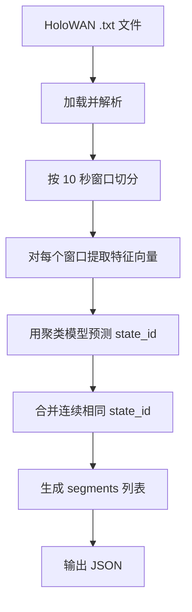

# NetFaker 状态序列提取模块设计文档（Trace Analyzer）

**版本**：1.0  
**目标**：从真实 HoloWAN 仿真文件中自动提取结构化的状态序列（`segments`），用于回放、分析或再生成。  
**定位**：与现有“规则生成”形成闭环，构成“分析 → 合成”双路径能力。

---

## 一、场景与价值

### 使用场景
- 用户上传一段实测或历史 HoloWAN 文件（如 `campus_network.txt`）
- 系统自动识别其中的网络状态变化模式
- 输出可直接用于 `/simulate` API 的 `segments` 列表
- 支持后续重放、对比、压力测试等

### 核心价值
- **自动化状态发现**：无需人工标注，自动聚类识别典型状态
- **真实轨迹回放**：将真实网络行为转化为可复现的仿真任务
- **数据闭环**：采集 → 聚类 → 分析 → 生成 → 验证

---

## 二、输入与输出规范

### ✅ 输入

| 类型 | 描述 | 格式/约束 |
|------|------|----------|
| **HoloWAN 文件** | 待分析的原始网络轨迹文件 | 标准 `.txt` 格式，含合法头信息和数据体 |
| **聚类模型** | 已训练的状态分类器 | 存于 `data/models/cluster_model.pkl`（由聚类流程生成） |
| **窗口参数** | 分析粒度 | 固定为 **10 秒 / 窗口**，**10 Hz 采样**（与生成端对齐） |

> 🔹 文件需包含至少一个完整 10 秒窗口（100 行数据）

---

### ✅ 输出

结构化 JSON，**完全兼容 `SimulationRequest.segments` 字段**：

```json
[
  { "type": "s2", "duration": 30 },
  { "type": "s5", "duration": 50 },
  { "type": "s2", "duration": 20 }
]
```

| 字段 | 含义 | 说明 |
|------|------|------|
| `type` | 状态标识 | 格式 `s{state_id}`，`state_id` 来自聚类结果 |
| `duration` | 持续时间 | 单位秒，必为 **10 的正整数倍**（因窗口粒度为 10s） |

> ✅ 输出可直接作为 `/api/v1/simulate` 的 `segments` 参数使用，实现“分析即回放”。

---

## 三、处理流程（端到端）



---

## 四、关键模块职责（复用 + 新增）

| 步骤 | 模块路径 | 职责 | 复用情况 |
|------|--------|------|--------|
| **1. 加载文件** | `simcore/io/holowan_loader.py` | 解析 HoloWAN 头部与数据体 | ✅ 已存在 |
| **2. 切分窗口** | `simcore/dataset/window_extractor.py` | 按 10s（100 行）切片 | ✅ 已存在 |
| **3. 特征提取** | `simcore/clustering/feature_extractor.py` | 计算延迟/丢包统计量（均值、方差等） | ✅ 已存在 |
| **4. 状态预测** | `simcore/clustering/cluster_runner.py` | 加载模型，预测每个窗口的 `state_id` | ✅ 已存在 |
| **5. 序列压缩** | `simcore/synthesizer/state_sequence_compressor.py` | 合并连续相同状态 → 生成 `segments` | 🔸 **新增** |

> 所有模块均在 `simcore/` 下，保持与生成逻辑同层，便于维护。

---

## 五、新增模块：状态序列压缩器

### 功能
将原始 `state_id` 序列（如 `[2,2,2,5,5,5,5,5,2,2]`）压缩为结构化 `segments`。

### 输入
- `List[int]`：每个窗口对应的 `state_id`
- `window_duration_sec = 10`（固定）

### 输出
- `List[Dict]`：符合 `segments` 格式的列表

### 压缩规则
- **连续相同状态合并**：`[s2 ×3, s5 ×5, s2 ×2]`
- **持续时间 = 窗口数 × 10**
- **顺序保持不变**

### 边界处理
- 空输入 → 返回空列表
- 单窗口 → 返回单 segment
- 不足 100 行的尾部窗口 → **丢弃**（保证窗口完整性）

---

## 六、入口方式（支持 CLI + 可选 API）

### 1. CLI 入口（推荐先实现）
- 路径：`scripts/analyze_trace.py`
- 用法：
  ```bash
  python scripts/analyze_trace.py \
    --input data/raw/real_trace.txt \
    --output data/outputs/segments.json
  ```
- 内部调用链：
  ```
  holowan_loader → window_extractor → feature_extractor → cluster_runner → compressor
  ```

### 2. API 入口（可选扩展）
- 路径：`POST /api/v1/analyze`
- 请求：
  ```json
  { "file_path": "data/raw/real_trace.txt" }
  ```
- 响应：
  ```json
  { "segments": [ ... ] }
  ```
- 注意：需考虑文件上传安全与路径隔离

---

## 七、与现有生成模块的协同

| 能力 | 模块 | 方向 |
|------|------|------|
| **合成** | `simcore/strategies/rule_based.py` | `segments` → HoloWAN 文件 |
| **分析** | `simcore/synthesizer/state_sequence_compressor.py` | HoloWAN 文件 → `segments` |

> 🔁 **形成闭环**：  
> `真实文件 → 分析 → segments → 生成 → 新仿真文件`

---

## 八、错误处理与限制

| 场景 | 处理方式 |
|------|--------|
| HoloWAN 文件格式错误 | 抛 `InvalidFileError`，提示行号或字段 |
| 文件少于 100 行 | 返回空 `segments`，记录警告日志 |
| 聚类模型缺失 | 启动失败，提示“请先运行聚类流程” |
| 特征维度不匹配 | 抛 `ModelError`，说明训练/推理不一致 |

---

## 九、总结

- **输入**：标准 HoloWAN `.txt` 文件 + 已训练聚类模型  
- **输出**：结构化 `segments` 列表，**100% 兼容生成 API**  
- **核心新增**：状态序列压缩器（仅几十行逻辑）  
- **高度复用**：90% 依赖已有 `simcore/` 模块  
- **工程价值**：打通“真实轨迹 → 可编程仿真”链路，提升系统实用性与闭环能力

